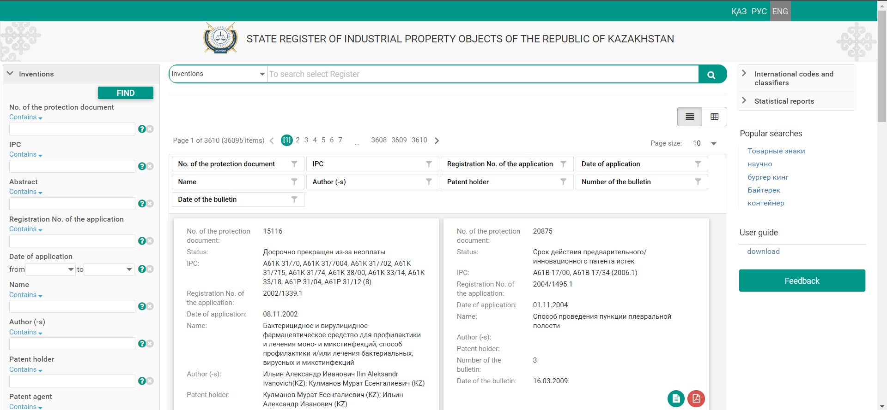
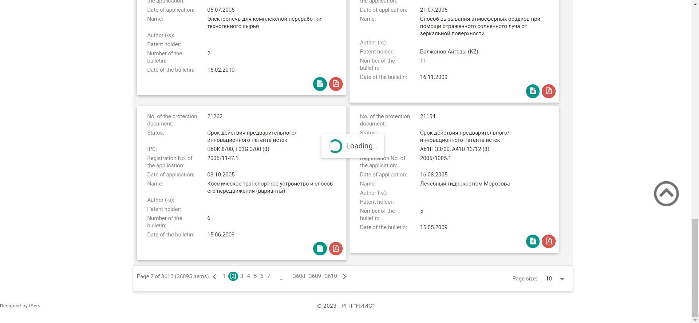

# Trademarks parser

## This project is about parsing trademarks from STATE REGISTER OF INDUSTRIAL PROPERTY OBJECTS OF THE REPUBLIC OF KAZAKHSTAN website.
## The main thing about website that it uses jQuery, so it is needed to use only selenium to parse values.

## Some screenshots of website

## Program has console simple console interface which is sufficient for project requirements.
